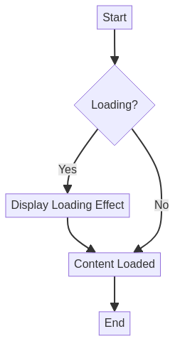

# CSS Loading Effects

[](LICENSE)
[](https://developer.mozilla.org/en-US/docs/Web/Guide/HTML/HTML5)
[](https://developer.mozilla.org/en-US/docs/Web/CSS)

**Table of Contents**

- [Demo](#-demo)
- [Features](#-features)
- [Technologies](#️-technologies)
- [Project Structure](#-project-structure)
- [How to Use](#-how-to-use)
- [Supported Effect Types](#-supported-effect-types)
- [Customization](#-customization)
- [Possible Extensions](#-possible-extensions)
- [Contributing](#-contributing)
- [License](#-license)
- [Author](#-author)


A collection of creative loading effects implemented purely with CSS3, including animations, transitions, and transformations to enhance the user experience during loading.

[Versão em Português](README.md)


## 🎯 Demo




This project provides a foundation for implementing modern loading effects using only CSS, without JavaScript dependencies.

## ✨ Features

- **Pure CSS Animations**: Effects implemented solely with CSS3
- **Smooth Transitions**: Fluid and responsive transformations
- **Modern Design**: Clean and professional interface
- **Optimized Performance**: Efficient animations using `transform` property
- **Responsive**: Adaptable to different devices

## 🛠️ Technologies

- **HTML5**: Semantic structure
- **CSS3**: Animations, transitions, and transformations
- **CSS Variables**: Customizable color system

## 📁 Project Structure

```
CSS-Loading-Effects/
├── public/
│   ├── index.html          # Demo page
│   └── examples/           # Usage examples
├── src/
│   └── styles.css          # Loading effects and styles
├── docs/                   # Additional documentation
├── tests/                  # Unit tests
├── config/                 # Configuration files
├── README.md               # Main documentation (Portuguese)
├── README.en.md            # Main documentation (English)
├── LICENSE                 # MIT License
└── .gitignore              # Files ignored by Git
```

## 🚀 How to Use

### Installation

1. Clone the repository:
```bash
git clone https://github.com/galafis/CSS-Loading-Effects.git
cd CSS-Loading-Effects
```

2. Open the `index.html` file in your browser:
```bash
# Using Python
python -m http.server 8000

# Using Node.js
npx serve .
```

### Implementing Effects

To add new loading effects, you can expand the CSS with animations like:

```css
/* Rotating spinner */
.spinner {
    width: 40px;
    height: 40px;
    border: 4px solid #f3f3f3;
    border-top: 4px solid var(--primary-color);
    border-radius: 50%;
    animation: spin 1s linear infinite;
}

@keyframes spin {
    0% { transform: rotate(0deg); }
    100% { transform: rotate(360deg); }
}

/* Pulse effect */
.pulse {
    animation: pulse 2s infinite;
}

@keyframes pulse {
    0% { transform: scale(1); }
    50% { transform: scale(1.1); }
    100% { transform: scale(1); }
}

/* Fade in/out */
.fade {
    animation: fade 3s infinite;
}

@keyframes fade {
    0%, 100% { opacity: 0.3; }
    50% { opacity: 1; }
}
```

## 🎨 Supported Effect Types

- **Transform Effects**: Scale, rotate, translate
- **Opacity Animations**: Fade in/out, pulse
- **Border Animations**: Loading bars, progress indicators
- **Gradient Animations**: Color transitions
- **Hover Effects**: Interactive feedback

## 🔧 Customization

Modify CSS variables to customize colors:

```css
:root {
    --primary-color: #667eea;    /* Primary color for effects */
    --secondary-color: #764ba2;  /* Secondary color */
}
```

## 📈 Possible Extensions

- [ ] More spinner types (dots, bars, waves)
- [ ] Skeleton loading effects
- [ ] Animated progress bars
- [ ] Loading overlays
- [ ] Shimmer effects
- [ ] JavaScript integration for dynamic control

## 🤝 Contributing

Contributions are welcome! To add new effects:

1. Fork the project
2. Create a branch for your effect (`git checkout -b feature/NewEffect`)
3. Commit your changes (`git commit -m 'Adds new loading effect'`)
4. Push to the branch (`git push origin feature/NewEffect`)
5. Open a Pull Request

## 📄 License

This project is licensed under the MIT License - see the [LICENSE](LICENSE) file for details.

## 👨‍💻 Author

**Gabriel Demetrios Lafis**

- GitHub: [@galafis](https://github.com/galafis)
- Email: gabrieldemetrios@gmail.com

---

⭐ If this project was helpful, consider leaving a star!

