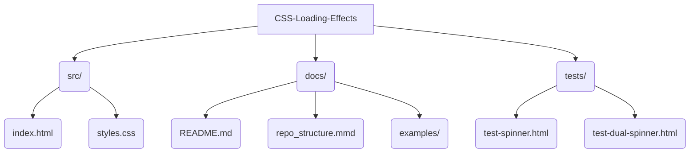
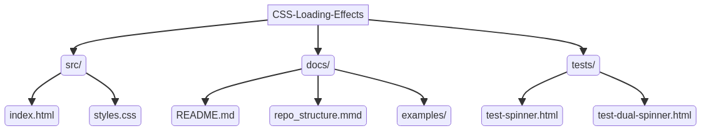

# CSS Loading Effects - Professional Collection


## Overview

This repository presents a professional collection of **CSS3 loading effects and animations**, meticulously crafted to provide elegant and performant visual feedback during asynchronous operations. Designed with modern web development in mind, these effects are pure CSS, ensuring no JavaScript dependencies for core animations, and are fully responsive and customizable.

## Features

-   **Pure CSS3**: All animations are implemented using native CSS3, ensuring high performance and broad browser compatibility.
-   **Responsive Design**: Optimized for seamless display across various devices and screen sizes.
-   **Customizable**: Easily adapt colors, sizes, and animation timings through CSS variables.
-   **Performance-Oriented**: Utilizes hardware-accelerated CSS properties for smooth and efficient animations.
-   **Modular Structure**: Each loading effect is encapsulated, allowing for easy integration into any project.

## Repository Structure

The project follows a clean and organized structure to facilitate development and maintenance:



Alternatively, here is a visual representation of the repository structure:



## Installation

To use these loading effects in your project, simply clone the repository:

```bash
git clone https://github.com/galafis/CSS-Loading-Effects.git
cd CSS-Loading-Effects
```

Then, link the `styles.css` file from the `src/` directory to your HTML:

```html
<link rel="stylesheet" href="path/to/CSS-Loading-Effects/src/styles.css">
```

## Usage Examples

### Classic Spinner

```html
<div class="spinner"></div>
```

### Bouncing Dots Loader

```html
<div class="dots-loader">
    <div class="dot"></div>
    <div class="dot"></div>
    <div class="dot"></div>
</div>
```

### Button with Loading State

```html
<button class="btn loading">Loading...</button>
```

For a full demonstration of all effects, open `src/index.html` in your browser.

## Live Demo

A live demonstration of these CSS Loading Effects is available on GitHub Pages: [https://galafis.github.io/CSS-Loading-Effects/](https://galafis.github.io/CSS-Loading-Effects/)

## Contributing

Contributions are welcome! Please feel free to open issues or submit pull requests to improve this collection.

## License

This project is licensed under the MIT License - see the [LICENSE](LICENSE) file for details.

## Author

Created with ❤️ by [Gabriel Demetrios Lafis](https://github.com/galafis)

---

# Efeitos de Carregamento CSS - Coleção Profissional

## Visão Geral

Este repositório apresenta uma coleção profissional de **efeitos e animações de carregamento CSS3**, meticulosamente elaborados para fornecer feedback visual elegante e performático durante operações assíncronas. Projetados com o desenvolvimento web moderno em mente, esses efeitos são puramente CSS, garantindo que não haja dependências de JavaScript para as animações principais, e são totalmente responsivos e personalizáveis.

## Funcionalidades

-   **CSS3 Puro**: Todas as animações são implementadas usando CSS3 nativo, garantindo alto desempenho e ampla compatibilidade com navegadores.
-   **Design Responsivo**: Otimizado para exibição perfeita em vários dispositivos e tamanhos de tela.
-   **Customizável**: Adapte facilmente cores, tamanhos e tempos de animação através de variáveis CSS.
-   **Orientado ao Desempenho**: Utiliza propriedades CSS aceleradas por hardware para animações suaves e eficientes.
-   **Estrutura Modular**: Cada efeito de carregamento é encapsulado, permitindo fácil integração em qualquer projeto.

## Estrutura do Repositório

O projeto segue uma estrutura limpa e organizada para facilitar o desenvolvimento e a manutenção:


## Instalação

Para usar esses efeitos de carregamento em seu projeto, basta clonar o repositório:

```bash
git clone https://github.com/galafis/CSS-Loading-Effects.git
cd CSS-Loading-Effects
```

Em seguida, vincule o arquivo `styles.css` do diretório `src/` ao seu HTML:

```html
<link rel="stylesheet" href="path/to/CSS-Loading-Effects/src/styles.css">
```

## Exemplos de Uso

### Spinner Clássico

```html
<div class="spinner"></div>
```

### Carregador de Pontos Saltitantes

```html
<div class="dots-loader">
    <div class="dot"></div>
    <div class="dot"></div>
    <div class="dot"></div>
</div>
```

### Botão com Estado de Carregamento

```html
<button class="btn loading">Carregando...</button>
```

Para uma demonstração completa de todos os efeitos, abra `src/index.html` em seu navegador.

## Demonstração ao Vivo

Uma demonstração ao vivo desses Efeitos de Carregamento CSS está disponível no GitHub Pages: [https://galafis.github.io/CSS-Loading-Effects/](https://galafis.github.io/CSS-Loading-Effects/)

## Contribuição

Contribuições são bem-vindas! Sinta-se à vontade para abrir issues ou enviar pull requests para melhorar esta coleção.

## Licença

Este projeto está licenciado sob a Licença MIT - consulte o arquivo [LICENSE](LICENSE) para obter detalhes.

## Autor

Criado com ❤️ por [Gabriel Demetrios Lafis](https://github.com/galafis)

