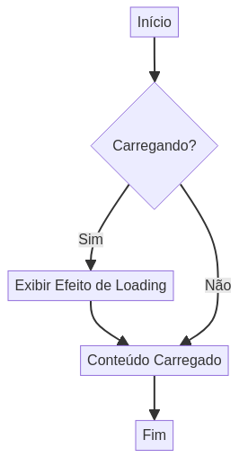

# CSS Loading Effects

[](LICENSE)
[](https://developer.mozilla.org/en-US/docs/Web/Guide/HTML/HTML5)
[](https://developer.mozilla.org/en-US/docs/Web/CSS)

**Índice**

- [Demonstração](#-demonstração)
- [Características](#-características)
- [Tecnologias](#️-tecnologias)
- [Estrutura do Projeto](#-estrutura-do-projeto)
- [Como Usar](#-como-usar)
- [Tipos de Efeitos Suportados](#-tipos-de-efeitos-suportados)
- [Personalização](#-personalização)
- [Extensões Possíveis](#-extensões-possíveis)
- [Contribuindo](#-contribuindo)
- [Licença](#-licença)
- [Autor](#-autor)


Coleção de efeitos de loading criativos implementados puramente com CSS3, incluindo animações, transições e transformações para melhorar a experiência do usuário durante carregamentos.

[English Version](README.en.md)


## 🎯 Demonstração




Este projeto apresenta uma base para implementação de efeitos de loading modernos usando apenas CSS, sem dependências JavaScript.

## ✨ Características

- **Animações CSS Puras**: Efeitos implementados apenas com CSS3
- **Transições Suaves**: Transformações fluidas e responsivas
- **Design Moderno**: Interface limpa e profissional
- **Performance Otimizada**: Animações eficientes usando transform
- **Responsivo**: Adaptável a diferentes dispositivos

## 🛠️ Tecnologias

- **HTML5**: Estrutura semântica
- **CSS3**: Animações, transições e transformações
- **CSS Variables**: Sistema de cores customizáveis

## 📁 Estrutura do Projeto

```
CSS-Loading-Effects/
├── public/
│   ├── index.html          # Página de demonstração
│   └── examples/           # Exemplos de uso
├── src/
│   └── styles.css          # Efeitos de loading e estilos
├── docs/                   # Documentação adicional
├── tests/                  # Testes unitários
├── config/                 # Arquivos de configuração
├── README.md               # Documentação principal
├── LICENSE                 # Licença MIT
└── .gitignore              # Arquivos ignorados pelo Git
```

## 🚀 Como Usar

### Instalação

1. Clone o repositório:
```bash
git clone https://github.com/galafis/CSS-Loading-Effects.git
cd CSS-Loading-Effects
```

2. Abra o arquivo `index.html` no navegador:
```bash
# Usando Python
python -m http.server 8000

# Usando Node.js
npx serve .
```

### Implementação de Efeitos

Para adicionar novos efeitos de loading, você pode expandir o CSS com animações como:

```css
/* Spinner rotativo */
.spinner {
    width: 40px;
    height: 40px;
    border: 4px solid #f3f3f3;
    border-top: 4px solid var(--primary-color);
    border-radius: 50%;
    animation: spin 1s linear infinite;
}

@keyframes spin {
    0% { transform: rotate(0deg); }
    100% { transform: rotate(360deg); }
}

/* Pulse effect */
.pulse {
    animation: pulse 2s infinite;
}

@keyframes pulse {
    0% { transform: scale(1); }
    50% { transform: scale(1.1); }
    100% { transform: scale(1); }
}

/* Fade in/out */
.fade {
    animation: fade 3s infinite;
}

@keyframes fade {
    0%, 100% { opacity: 0.3; }
    50% { opacity: 1; }
}
```

## 🎨 Tipos de Efeitos Suportados

```mermaid
graph TD
    A[CSS Loading Effects] --> B[Categorias de Efeitos]
    B --> B1[Transform Effects]
    B --> B2[Opacity Animations]
    B --> B3[Border Animations]
    B --> B4[Gradient Animations]
    B --> B5[Hover Effects]
    B1 --> C[Pipeline de Animação]
    B2 --> C
    B3 --> C
    B4 --> C
    B5 --> C
    C --> D1[@keyframes Definition]
    D1 --> D2[animation Property]
    D2 --> D3[duration · timing · delay · iteration]
    D3 --> E[CSS Variables]
    E --> E1[--primary-color]
    E --> E2[--secondary-color]
    E1 --> F[Rendered Loading Effect]
    E2 --> F
    B1 --> G1[scale · rotate · translate]
    B2 --> G2[fade · pulse]
    B3 --> G3[progress bars · spinners]
    B4 --> G4[color transitions]
    B5 --> G5[interactive feedback]
```

- **Transform Effects**: Scale, rotate, translate
- **Opacity Animations**: Fade in/out, pulse
- **Border Animations**: Loading bars, progress indicators
- **Gradient Animations**: Color transitions
- **Hover Effects**: Interactive feedback

## 🔧 Personalização

Modifique as variáveis CSS para personalizar cores:

```css
:root {
    --primary-color: #667eea;    /* Cor principal dos efeitos */
    --secondary-color: #764ba2;  /* Cor secundária */
}
```

## 📈 Extensões Possíveis

- [ ] Mais tipos de spinners (dots, bars, waves)
- [ ] Efeitos de skeleton loading
- [ ] Progress bars animadas
- [ ] Loading overlays
- [ ] Efeitos de shimmer
- [ ] Integração com JavaScript para controle dinâmico

## 🤝 Contribuindo

Contribuições são bem-vindas! Para adicionar novos efeitos:

1. Fork o projeto
2. Crie uma branch para seu efeito (`git checkout -b feature/NovoEfeito`)
3. Commit suas mudanças (`git commit -m 'Adiciona novo efeito de loading'`)
4. Push para a branch (`git push origin feature/NovoEfeito`)
5. Abra um Pull Request

## 📄 Licença

Este projeto está licenciado sob a Licença MIT - veja o arquivo [LICENSE](LICENSE) para detalhes.

## 👨‍💻 Autor

**Gabriel Demetrios Lafis**

- GitHub: [@galafis](https://github.com/galafis)
- Email: gabrieldemetrios@gmail.com

---

⭐ Se este projeto foi útil, considere deixar uma estrela!
